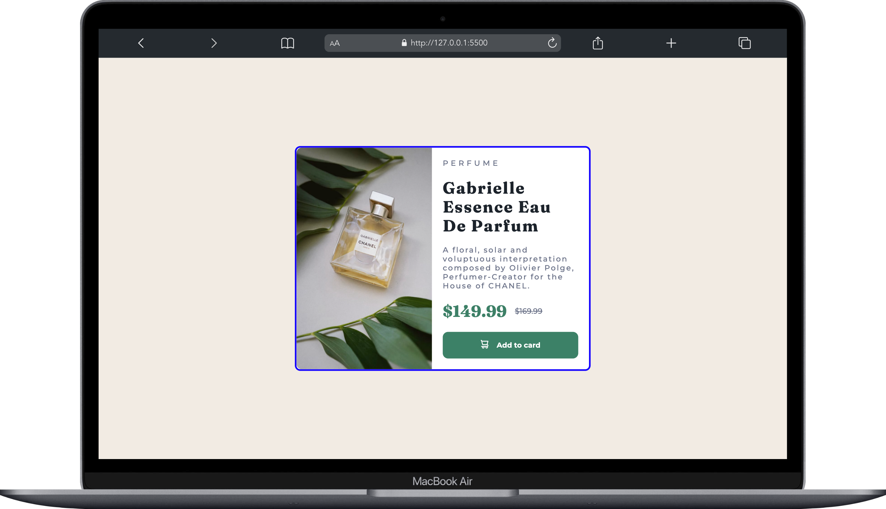

# Frontend Mentor - Product preview card component

- [Frontend Mentor - Product preview card component](#frontend-mentor---product-preview-card-component)
  - [Welcome! 👋](#welcome-)
  - [The challenge](#the-challenge)
  - [Screenshot](#screenshot)
    - [Mobile View](#mobile-view)
    - [Desktop View](#desktop-view)
  - [Technologies Used](#technologies-used)
  - [Acknowledgments](#acknowledgments)

## Welcome! 👋

This repository contains my solution to the [Product preview card component](https://www.frontendmentor.io/challenges/product-preview-card-component-GO7UmttRfa/hub) offered by Frontend Mentor.

## The challenge

The Challenge is to build out this **"product preview card component"** and get it looking as close to the design as possible.

*Basic Requirement for this challenge is HTML and CSS.*

## Screenshot

### Mobile View

### Desktop View

  

## Technologies Used

In completing this challenge, I utilized the following technologies and methodologies:

- Semantic HTML5 markup
- CSS properties and media queries
- Flexbox
- Mobile First Approach

## Acknowledgments

I would like to express my gratitude to [Frontend Mentor](https://www.frontendmentor.io/home) for this challenge. It was a fantastic experience.  
**[Frontend Mentor](https://www.frontendmentor.io/)**: Thank you for providing challenging and educational projects for developers.
